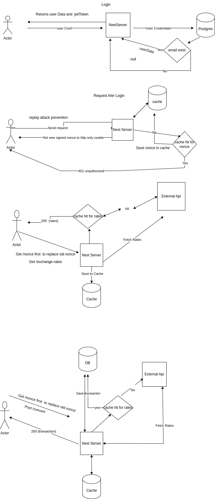

## THIS README CONTAINS SYSTEM DESIGN AND SET UP INSTRUCTIONS 

# SETUP INSTRUCTIONS 
- YOU CAN USE docker compose to start the frontend and backend application
- Set the right values for the env variables for each service in the docker-compose.yml especially the Open_Exchange env 
- run docker compose up 

---
- Without docker compose  create an env file in the root folder of each project
- for backend these are the env variables you need
- DATABASE_URL 
- JWT_SECRET
- JWT_SECRET_NONCE
- OPEN_EXCHANGE

 A user is created when the backend app starts with credentials
 email : test@wewire.com
 password: password123
backend application url :http://localhost:8080

- for frontend 
- VITE_BASE_URL
 frontend app url : http://localhost:5173

- npm run start:devapp to start backend app
- npm run dev to start frontend

# SYSTEM DESIGN

# Login
A user with valid credentials receives a `200 OK` response. A JWT token is returned and saved in `localStorage`.

# Replay Attack Prevention
To mitigate replay attacks, a **nonce** is generated every time a user wants to make a request.

1. Before accessing a protected resource, the user must request a nonce.
2. This nonce request requires a valid JWT token from `localStorage`.
3. A signed nonce (with a 5-minute expiration) is returned and sent to the client as an **HTTP-only cookie**.
4. The user then proceeds with the actual request, sending the nonce cookie along.

On each protected request:
- The backend verifies the nonce.
- If the nonce **already exists in cache** (i.e., it was reused), a `401 Unauthorized` is returned.
- If the nonce is **not found in cache**, it is saved and the request is allowed.

This mechanism ensures each nonce is used only once.

# /convert and /exchange-rates
These APIs fetch data from external sources.  
To reduce latency and limit external calls:
- Fetched exchange rates are **cached with a short TTL** (Time-To-Live).
- This speeds up repeated requests and helps improve performance.

